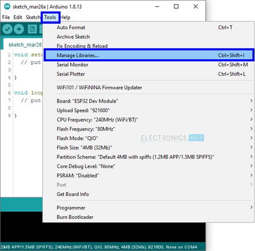
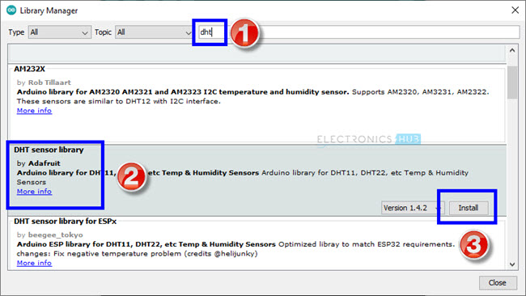
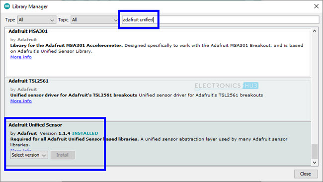

# ESP32 home ambient monitor.

## Hardware

### ESP32 wroom

This is a device we are going to place the logic of the project and to report in our reporting infrastructure (HTTP POST or MQQT) the readings of the sensor temperature and humidity.


### ESP32 Pinout

One popular ESP32 Development Board available today is the 30-pin version shown in the above image. It consists of ESP-WROOM-32 as the baseboard and additionally few pins and components to easily interact with ESP32.

The following image shows the pinout of a 30-pin ESP32 DevKit Development Board.


### Temperature and humididty Sensor

We are going to use [DHT11](https://components101.com/sensors/dht11-temperature-sensor) Temperature and Humidity Sensor module or similar with three pinouts

- Vcc - Power supply 3.5V to 5.5V
- Data - Outputs both Temperature and Humidity through serial Data
- Ground - Connected to the ground of the circuit

This is a simple sensor you can get online very cheap


### Assembly
We can connect together the ESP32 and the rest of the devices on a bradboard. Connection schematics belo

TODO


## Software

We are going to use Arduino studio to build the software layer for this project. In a high level overview the software logic would have to achieve the following

- Connect to a wireless network. Initially would be hardcoded SSID but a feature can be added to allow a selection of the AP while the ESP32 device is starting up
- Read the tempoerature and humidity from the DHT11 (or any other) sensor
- Post this data on a message broker or a HTTP POST for long term retention.
- (Optional) build a graph for example with Grafana to visualize the historical data.

## Preparing Arduino IDE
We need to download a couple of libraries so that ESP32 will properly communicate with DHT11 Sensor. First is main DHT11 Sensor Library. Go to Tools -> Manage Libraries… in Arduino IDE.



In the search bar, enter ‘dht’. Scroll through the options and install ‘DHT sensor library’ by Adafruit.



The next library is associated with the Adafruit itself. Search for ‘adafruit unified’, scroll down and install ‘Adafruit Unified Sensor’ library.



### Displaying Humidity and Temperature on Serial Monitor

After making the proper connections and installing the necessary libraries as mentioned above, we will now see how to read the humidity and temperature data from DHT11 Sensor using ESP32 and display the result on the Serial Monitor.

### Code
This is a simple code which will assign pin 16 (RX2) from the picture above to DHT11 Sensor, initialize the DHT11 Sensor and reads the humidity and temperature data from the sensor.

To view the result, simply use the serial monitor to print the temperature values in % for Humidity and degree Celsius for temperature.

```arduino
#include "DHT.h"
#define DHT11PIN 16

DHT dht(DHT11PIN, DHT11);
void setup()
{
  
  Serial.begin(115200);
/* Start the DHT11 Sensor */
  dht.begin();
}

void loop()
{
  float humi = dht.readHumidity();
  float temp = dht.readTemperature();
  Serial.print("Temperature: ");
  Serial.print(temp);
  Serial.print("ºC ");
  Serial.print("Humidity: ");
  Serial.println(humi);
  delay(1000);
}
```

We can now see in the Serial Monitor the temperature and the humidity.


